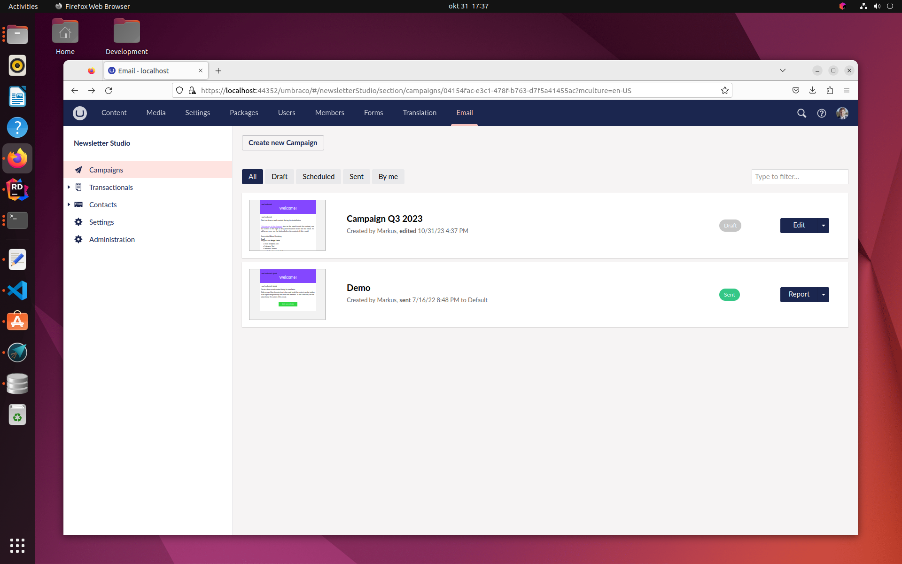

---
title: Running on Linux
description: Information about running Newsletter Studio on Linux
---
# Running on Linux and Mac
In version 12.1.0 we added support for running Newsletter Studio on Linux and Mac. While [this was possible](https://our.umbraco.com/packages/backoffice-extensions/newsletter-studio-the-email-studio/comments/109227-template-file-paths-not-working-on-a-linux-server) in earlier versions, it required some nasty hacks that you want to avoid.

## Before you start

While developing applications that should run on Unix-like systems like Linux and MacOS it's important to keep in mind that **the file system is case sensitive**. This means you need to make sure that files and folder names are in the correct case. The files `Text.txt` and `test.txt` are considered two different files in the Unix-world, but on Windows they could not exist at the same time since Windows is case insensitive.

Our folder and file naming used to be inconsistent, so to support Linux/Mac we have made some changes and clarifications around naming conventions. While this is mandatory for Unix-like runtimes it's a good practice to follow even on Windows.

Folders and files should be named using `lowercase` or `camelCase`. This means that we have changed the folder names for a couple of common folders in the package:
  * `App_Plugins/NewsletterStudio` &gt; `App_Plugins/newsletterStudio`
  * `App_Plugins/NewsletterStudioExtensions` &gt; `App_Plugins/newsletterStudioExtensions`
  * All themes-folders and file names are lower case:
    * `App_Plugins/NewsletterStudioExtensions/Views/Controls/Button.cshtml` &gt; `App_Plugins/newsletterStudioExtensions/views/controls/button.cshtml`
    * `App_Plugins/MyPlugin/NewsletterStudio/Themes/MyTheme/Views` &gt; `App_Plugins/myPlugin/newsletterStudio/themes/myTheme/views`
    * `App_Plugins/MyPlugin/NewsletterStudio/Themes/MyTheme/Views/Controls/Button.cshtml` &gt; `App_Plugins/newsletterStudio/myPlugin/newsletterStudio/themes/myTheme/views/controls/button.cshtml`

The documentation has been updated to reflect this new naming standard for files and folders.

This feature will not be back-ported to other versions of the package due to the lack of support for Razor Class Libraries in the Umbraco-core in earlier versions. If you need Linux support, consider upgrading to Umbraco 12 or hihger. We will continue to support the package on Linux and MacOS going forward.