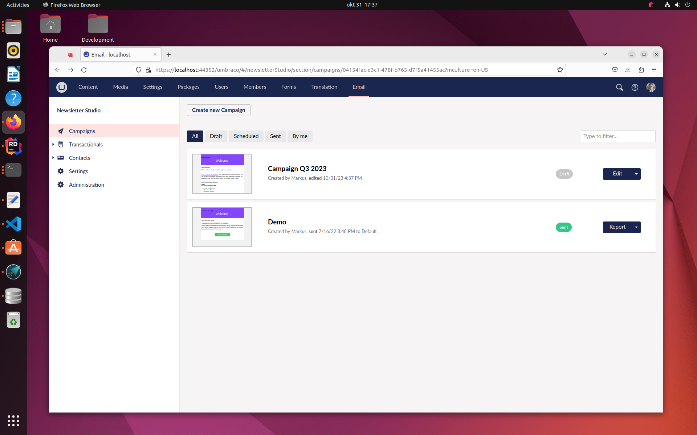

---
title: Running on Linux
description: Information about running Newsletter Studio on Linux
---
# Running on Linux and Mac
To embrace the cross platform nature of Umbraco and modern .NET, Newsletter Studio fully supports running on Linux and Mac. 

## Before you start

While developing applications that should run on Unix-like systems like Linux and MacOS, it's important to keep in mind that **the file system is case sensitive**. This means you need to make sure that files and folder names are in the correct case. The files `Text.txt` and `test.txt` are considered two different files in the Unix-world, but on Windows they could not exist at the same time since Windows is case insensitive.

### Upgrading?
Our folder and file naming used to be inconsistent, so to support Linux/Mac we havd to make changes and clarifications around naming conventions. While being consistent is mandatory for Unix-like runtimes, it's also a good practice to follow even when running on Windows.

Folders and files should be named using `lowercase` or `camelCase`. This means that we've changed the folder names for a couple of common folders in the package:
  * `App_Plugins/NewsletterStudio` &gt; should be &gt;  `App_Plugins/newsletterStudio`
  * `App_Plugins/NewsletterStudioExtensions` &gt; should be &gt; `App_Plugins/newsletterStudioExtensions`
  * All themes-folders and file names are `camelCase`:
    * `App_Plugins/NewsletterStudioExtensions/Views/Controls/Button.cshtml` &gt; should be &gt; `App_Plugins/newsletterStudioExtensions/views/controls/button.cshtml`
    * `App_Plugins/MyPlugin/NewsletterStudio/Themes/MyTheme/Views` &gt; should be &gt; `App_Plugins/myPlugin/newsletterStudio/themes/myTheme/views`
    * `App_Plugins/MyPlugin/NewsletterStudio/Themes/MyTheme/Views/Controls/Button.cshtml` &gt; should be &gt; `App_Plugins/newsletterStudio/myPlugin/newsletterStudio/themes/myTheme/views/controls/button.cshtml`

The documentation has been updated to reflect this new naming standard for files and folders. We will continue to support the package on Linux and MacOS going forward.